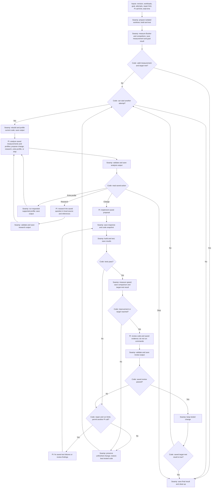

# Tempo

Tempo is a local Swamp workflow for measured Busker optimization. Swamp builds,
tests, profiles, measures, compares, and manages isolated Git worktrees. Pi reads
saved evidence and edits files; it cannot run commands.

The workflow has passed fixed-response integration exercises and short HTTP
smoke checks. No optimization inference or real improvement run has executed.
First-run revision, target, H2 allowance, and budgets still need explicit choices.

## Check the local benchmark integration

Use the Nix development shell and existing local native build output. Run
`bb build` first if that output needs updating; do not run other commands during
the build. From the Busker repository root:

```sh
repo="$PWD"
cd swamp
swamp workflow validate tempo-smoke
swamp workflow run tempo-smoke \
  --input "runId=smoke-$(date +%s)" \
  --input "repository=$repo" \
  --input "outputRoot=$repo/swamp/.swamp"
```

This runs H1 followed by TLS H2, with one-second warmup and measurement periods
and one repetition per protocol. It checks local source/native identity, JVM
settings, protocol negotiation, sample validity, and summary consistency.
The results have `purpose: smoke` and `score: null`; do not use their rates as
performance evidence. Existing output directories are never overwritten.

Swamp saves results and raw logs, including failed commands. Generated TLS
private keys and keystores stay in the private local run directory and are
excluded from archived artifacts. An assertion failure stops the next step.

## Revised flow

`PI` marks every inference step. All other steps run code without inference.
Each PI step reads named Swamp outputs. Swamp saves its response before the next
step starts; no step depends on a previous Pi session's memory.



For readability, the diagram omits two rules that apply to every step:

- Before starting a step, Swamp checks elapsed time and the relevant counters.
  When a limit is reached, it saves unfinished work and goes to the final step.
  It never stops an active Pi call because the run duration expired.
- Missing, malformed, or invalid measurement data stops the run with an error.
  It does not follow the normal "target not met" path. Pi does not repair the
  benchmark or profiler during an optimization run.

A target-met measurement ends further optimization, but an edited version still
needs its review before it can become the final result. If time expires before
that review, Tempo saves it as unfinished, not as success. A review repair always
returns through tests and measurement.

## Goals and limits

The caller supplies the goal. `beat-all` compares Busker with every required
competitor for every selected workload. `improve-baseline` compares with the
initial Busker score using the caller's multiplier. Missing scores are not wins.
`beat-all` checks every adapter supporting each selected protocol. H1 includes
Aleph, Capra, Hirundo, http-exchange, http-kit, Jetty, and Undertow; TLS H2 includes
Aleph, Hirundo, Jetty, and Undertow. A hand-picked subset is rejected.

The initial score never changes. The best tested version changes only after a
successful experiment. Profiles cannot provide benchmark scores.

Limits include attempts, repairs per attempt, total Pi calls, and elapsed time.
An attempt includes analysis, optional research, implementation, tests, and
measurement. A repair does not create a new attempt. A Pi-call limit also bounds
repeated research or extra-profile requests. An attempt limit prevents starting
another attempt; it does not abandon the last permitted attempt halfway through.

Each scored cell collects two complete batches of the configured three or six
samples per batch before deciding precision. Invalid execution or insufficient
remaining time can stop collection early, but a first batch alone never establishes
a score. The score is the arithmetic mean of all six or twelve positive rates.
Precision passes when the two-sided Student-t confidence interval's half-width,
divided by the mean, is at most `policy.precision.relativeHalfWidth` at
`policy.precision.confidenceLevel`. Defaults are `0.05` and `0.95`. Failed
precision is inconclusive, never a score or target claim.
An imprecise baseline stops the campaign. A completed, error-free but imprecise
candidate is discarded, and the campaign continues from the verified best if
limits permit. Execution and provenance failures still stop the campaign.
Saved config, benchmark output, and comparison evidence identify
`arithmetic-mean-student-t-v1`, the exact precision settings, and the fixed count.
Median-era evidence cannot be imported or silently reclassified.
H1 improvement and H2 protection still compare point estimates; those checks do
not establish statistical significance between versions.

The separate unscored fixed-placement repeatability check uses the same six-sample
precision calculation for each protocol. Its optional third CLI argument is a JSON
precision object, for example `'{"relativeHalfWidth":0.05,"confidenceLevel":0.95}'`;
omitting it selects the defaults. Its report records normalized precision settings,
the estimator version, and six planned samples per protocol. Before treating a
report as applicable to an intended campaign, compare those fields exactly with
the parsed campaign input and require `passed: true` plus matching source, native
library, and method evidence. No unscored samples become campaign anchors.

## Configure a real run

Do not use smoke results as a baseline. Choose the starting commit and obtain
authorization for the actual run first. The selected commit must contain the
`bench:local` integration and the shim-first `:bench-local` classpath in
`deps.edn`; uncommitted main-checkout changes are not copied into the experiment.

Use the Nix devshell on Linux with a running systemd user manager, Swamp, Pi,
h2load, and JDK tools. Keep other heavy work off the machine during measurement.
The current runner records affinity and cgroup settings but does not reserve CPUs.
The current method pins the coordinator and full server JVM to physical CPUs
10–11, and warmup and measured h2load clients to CPUs 12–13. Profiling uses the
same allocation; Pi, QA, the controller, and REPL do not. Each sample records JVM
thread masks at readiness and at measurement start and end. The h2load wrapper
checks the launched executable and live task masks. These are point-in-time
checks, not proof of continuous CPU residence. Missing or inconsistent evidence
invalidates the measurement; unpinned historical results cannot be imported.

Create a YAML input file containing these required fields:

| Field | Meaning |
| --- | --- |
| `confirmLive` | Explicit `true` authorizes builds, tests, benchmarks, and provider calls |
| `runId` | Unique filesystem-safe identifier, at most 80 characters |
| `repository`, `revision` | Absolute checkout path and full starting commit hash |
| `directory` | New absolute private output directory outside the experiment worktree |
| `supportDirectory`, `supportRevision`, `supportSha256` | Absolute frozen Swamp repository path, reviewed source commit, and SHA-256 of its runtime manifest |
| `credentialDirectory` | Pi agent directory containing its authentication files; never archived |
| `referenceRoots` | Explicit array of readable local reference directories |
| `experimentBrief` | Optional prepared plain-text hypotheses, rationale, and exclusions (at most 32,768 characters); omit it to retain the previous analysis flow |
| `parameters` | `warmup`, `duration` in seconds; `repetitions` must be `3` or `6` per batch, fixed before launch; `connections`, `streams`, `threads` |
| `limits` | `maxAttempts`, `maxRepairsPerAttempt`, `maxPiCalls`, `maxDurationMs` |
| `policy.goal` | `{kind: improve-baseline, multiplier: <chosen value>, workloads: [h1]}` or `{kind: beat-all, competitors: {h1: <all H1 competitors>}}` |
| `policy.protections` | `[{workload: tls-h2, maxDecreaseFraction: <chosen fraction>}]` |
| `policy.minimumImprovementFraction` | Strict improvement over the declared best H1 score; keep the original H2 floor |
| `policy.precision` | Optional `{relativeHalfWidth: 0.05, confidenceLevel: 0.95}`; half-width must be positive and confidence strictly between zero and one |
| `policy.scorePolicyVersion` | Optional; if specified, must be `arithmetic-mean-student-t-v1` |


Copy support code from the exact reviewed Git commit into a new private path, not
from the dirty checkout. The snapshot must contain `swamp/.swamp.yaml`,
`extensions/models/` (including transitive imports), `models/`, `workflows/`,
`prompts/`, `pi/`, and `clojure/`. For example, from the Busker root:

```sh
support_revision=<reviewed-full-commit-hash>
snapshot_root=<new-private-directory>
install -d -m 700 "$snapshot_root"
git archive "$support_revision" swamp/ | tar -x -C "$snapshot_root"
support_directory="$snapshot_root/swamp"
chmod -R a-w "$support_directory/.swamp.yaml" "$support_directory/extensions" \
  "$support_directory/models" "$support_directory/workflows" \
  "$support_directory/prompts" "$support_directory/pi" "$support_directory/clojure"
cd "$support_directory"
deno eval 'import { supportManifest } from "./extensions/models/_lib/support.ts"; console.log((await supportManifest(Deno.cwd())).sha256)'
swamp --version
swamp workflow validate tempo
```

Use the printed digest as `supportSha256` and the selected commit as
`supportRevision`. Inspect the complete file list in the saved run configuration.
The snapshot root must remain writable so Swamp can create its local `.swamp/`
datastore; only runtime source files are read-only. The manifest excludes this
generated datastore and the private run output, but detects edits, additions,
deletions, and symlinks in all runtime source directories. Execute the CLI
from the snapshot path and set `supportDirectory` to that same path. Verify
`.swamp.yaml` has only local settings; clear remote-service environment
variables. Record the snapshot path, Git commit, digest, `swamp --version`,
and `.swamp/` path with the run ID before launch. A changed snapshot or CLI
version refuses resume. A fix needs a fresh snapshot, run ID, and output
directory; never hot-patch an active run.
H1 optimization requires an explicit H2 allowance. The minimum acceptable H2
score is computed from the **initial** baseline, preventing cumulative losses.
An H1 candidate must beat the **best tested** version, not merely the initial
one. Matching workload, host, Java, h2load, source, and native-library checks
precede each comparison. No target or budget defaults substitute for user input.

After choosing and reviewing that file, run from this directory:

```sh
swamp workflow validate tempo
swamp workflow run tempo --input-file /absolute/path/to/run-inputs.yaml --log
swamp data get tempo "<runId>-report" --json
```


`swamp workflow run` blocks until the whole model call returns. For an authorized
supervised run, the operator launches it asynchronously from the dedicated
agent's terminal under `tempo-controller-<runId>.scope`, using a private
`controller.log` and recording the unit, cgroup, PID and process start time.
Keep a separate supervisor shell available; a Pi Link message cannot interrupt
an active tool call. Never put the operator's Pi session or the shared nREPL
inside the controller scope. After launch, inspect the exact controller unit
and send its identity and paths to the supervisor before the first measurement.

On a defect, verify that identity in a separate shell, then freeze that exact
controller unit with `systemctl --user freeze tempo-controller-<runId>.scope`.
Confirm `FreezerState=frozen` before doing anything else: this prevents another
phase from starting. Use `systemctl --user kill --signal=SIGKILL --kill-whom=all`
on the same verified controller unit and confirm its recorded PIDs are gone
or no longer executable (a transient unit can remain loaded briefly after
the processes exit). Then inspect and stop only the separate child units
`tempo-<runId>-*.scope`, comparing their descriptions, cgroups, and PIDs.
For implement/repair, the child set includes the dedicated
`tempo-<runId>-repl.scope`. Verify its description and processes separately,
stop it if still active, and confirm it has stopped before recording child
cleanup. The shared main REPL is not part of this run and must remain untouched.
If freeze or kill fails, do not continue based on an assumed stop; report
the exact error and inspect live processes. Preserve the private directory,
raw command logs, Swamp data, Git worktree/index and `refs/tempo/<runId>/*`.
Abrupt stop leaves an active step: inspect its saved result before using
`tempo.recover`. Missing results refuse recovery and must not be replayed;
abandon that run with evidence intact if reconciliation is ambiguous.
Controller termination protects logs against lost pipe buffers because
children write directly into exclusive private files. It does not claim
power-loss durability.
`tempo.run` prepares `.worktrees/tempo-<runId>`, runs `bb qa`, and establishes the
initial scores. It then executes the loop shown above. Every candidate returns
through `bb qa`, fresh measurements, and a read-only review before acceptance.
Pi is fixed to `openai-codex`, `gpt-6-astra`, and medium thinking. The
Markdown prompts are exported with the support snapshot; each invocation archives
the exact prompt copies it used.
For review, Swamp also archives the exact best-to-candidate Git diff with both
revisions and its SHA-256. The reviewer receives it as a read-only, citable input
without needing Git access.
At run start, Tempo saves the untracked project `AGENTS.md` as a separate
versioned inference input containing its exact text and SHA-256. The input is
read-only guidance, not Git-reviewed support code; system and step instructions
and tool permissions take precedence. Do not git-add that local file.
If supplied, Tempo saves `experimentBrief` with its SHA-256 in a versioned input
and presents it to analysis alongside saved profile and measurement results. Pi can
cite that input, but the brief is not a measured result or permission to combine
independent changes. A restart must supply the same brief; omitting it from a
run with no brief leaves the existing behavior unchanged.
During implement and repair, Tempo starts one new `bb dev` REPL in the
experiment worktree in a dedicated `busker` tmux window. Only those stages
may use `tempo_repl_eval` through normal `brepl` discovery for diagnostic
evaluation, namespace reload, and focused tests. Pi JSONL preserves the forms,
responses, and errors. Stop cleanup precedes official `bb qa` and benchmarks.
REPL evaluation can affect the JVM and files; this tool is not a sandbox.
Native shim edits need a rebuild and restarted REPL before native tests.

The final report includes the stop reason, best and unfinished revisions, worktree
path, validity, and target result. `bestVerified` requires passing initial tests
and valid baseline measurements; an infrastructure failure is not a successful
workflow. Budget exhaustion can finish normally without meeting the target.
Git refs under `refs/tempo/<runId>/` retain snapshots and the best revision.
The main checkout is unchanged, and the experiment finishes at the best revision.

## Adopt accepted changes

Experiment commits are private checkpoints, not ready-made project commits.
They use the repository's configured `user.name` and `user.email`. Configure
those before starting a run. Acceptance updates only the experiment's best
reference; it does not authorize merging its checkpoint history into `main`.

After the final report confirms valid, reviewed results:

- Start from a clean index and check the configured Git identity.
- Apply each accepted change with `git cherry-pick --no-commit <checkpoint>`,
  then create a normal `git commit` explaining why the change matters and any
  important implementation choices. Do not reuse the checkpoint message or
  fast-forward the experiment branch into `main`.
- Compare the adopted application files with the tested best using
  `git diff --no-ext-diff --exit-code <tested-best> HEAD -- <accepted-paths>`.
  If intervening application changes prevent an exact match, resolve and test
  them rather than claiming the combined version was benchmarked.
- Record the checkpoint-to-project commit correspondence in the run notes.
  Keep the original experiment refs and measurement records unchanged.

## Saved evidence and recovery

Each phase reserves its sequence number, performs the action, saves its output,
then advances state. Every inference reads exact saved resource versions in a
fresh Pi process. Its raw output remains available even when parsing fails.
Handoffs include the last 20 phase outcomes; failed tests include bounded log
excerpts so repairs can read the actual failure. Complete logs remain archived.

Use `swamp data get`, `swamp data query`, and Swamp's generated reports to inspect
evidence. Resources and files use infinite retention. Private TLS keys and
keystores are excluded from archives. Pi credentials are never part of artifacts.

After an interrupted run, inspect its state and processes before continuing.
`tempo.recover` completes a reserved step only when its saved result already
exists. It refuses to repeat an ambiguous action. `tempo.resume` requires
`confirmLive: true` and no unresolved active step; it uses the saved configuration.
A cleanup failure keeps the run unfinished and preserves the worktree. Never
resolve it by killing unrelated Java or Pi processes.

## Start fresh after an abandoned run

Do not run either workflow while an old controller or child scope remains active.
After the verified freeze, controller stop, and separate child stops above, read
the latest exact `<runId>-state` version with `swamp data versions tempo`. An
unresolved `activeStep` cannot be recovered by replay. Ask the leader to approve
abandoning that run; save `abandoned.json` in its private output directory
with `approvedBy: tempo-leader@busker`, the exact run ID, active step, state
checksum, and true `controllerStopped`, `childrenStopped`, and
`refsAndLogsPreserved` fields. Record the actual stop observations separately.
Never claim these checks succeeded merely because the receipt exists.

From the unchanged parent support snapshot, export its exact-version config,
state, step results, referenced artifacts, partial Pi logs, and receipt:

```sh
deno eval 'import { exportParentEvidence } from "./extensions/models/_lib/campaign.ts"; console.log(await exportParentEvidence(Deno.cwd(), "<old-run-id>", <latest-state-version>, "/absolute/private/parent-evidence.json", "/absolute/private/old-output/abandoned.json"))'
```

For a normally finished parent, omit the last receipt argument. Save the printed
SHA-256 with the new run inputs. Inspect the export and the best revision;
do not invent a measurement or change the original baseline. Prepare a **new**
reviewed support snapshot and output directory, with a new run ID. In the new
input file, keep the identical policy, limits, and benchmark parameters, set
`revision` to the verified best commit, and add `parentEvidence` with the
absolute bundle `path` and printed `sha256`. Validate
and run `tempo-restart` instead of `tempo` only after a separate release for
that exact new run. The new workflow repeats H1 and TLS H2 for the best commit
before another attempt. Attempt, Pi-call, and wall-clock reservations include
all preceding runs, including the interrupted effect. Missing, changed, live,
inconsistent, exhausted, or unapproved parent evidence refuses the restart.
An `abandoned.json` receipt also disables `tempo.resume` and `tempo.recover`
for the old run.

## Check profiling and control flow without inference

The separate profile smoke workflow accepts `ctimer`, `wall`, `alloc`, or `jfr`:

```sh
repo="$PWD" # from the Busker repository root
cd swamp
swamp workflow run tempo-profile-smoke \
  --input "runId=profile-smoke-$(date +%s)" \
  --input "repository=$repo" \
  --input "outputRoot=$repo/swamp/.swamp" \
  --input "collectorDirectory=$repo/swamp/clojure" \
  --input event=ctimer --input protocol=h1
```

Profiles always have `diagnosticOnly: true` and `score: null`. See
[profiling.md](profiling.md) for attribution and accounting limitations.

From the repository root, using Swamp's Deno executable if Deno is not on PATH:

```sh
deno test swamp/tests/*_test.ts
deno test --allow-all swamp/tests/integration
deno fmt --check swamp/extensions/models swamp/pi swamp/tests
deno lint swamp/extensions/models swamp/pi swamp/tests
deno check swamp/extensions/models/tempo.ts
bb fmt swamp/clojure && bb lint swamp/clojure
```

The complete workflow fixture creates a disposable Swamp repository and Git
checkout. Fixed executables replace Pi, builds, benchmarks, and profiles; no
provider is contacted. It exercises research, extra profiling, test and review
repairs, acceptance, H2 rejection, malformed responses, duration expiry, lost
archives, cleanup retry, saved-result recovery, and all-competitor comparison.
Fixture reports are explicitly diagnostic and cannot claim a performance goal.
The installed Pi file tools are also exercised separately without inference.

## Implementation map

- `workflows/`: the real workflow and independent benchmark/profile smoke checks.
- `extensions/models/tempo.ts`: model resources and entry methods.
- `extensions/models/_lib/run.ts`: explicit phase actions and compact handoffs.
- `state.ts`, `driver.ts`, `inference.ts`: transitions, durable results, and recovery.
- `benchmark*.ts`, `measurement.ts`, `control.ts`: execution, validation, comparisons, limits.
- `profile*.ts`, `counters.ts`, `clojure/tempo/profile.clj`: recordings and summaries.
- `workspace.ts`, `process.ts`, `artifacts.ts`, `test-runner.ts`: Git, scoped commands, preservation, tests.
- `pi/`, `pi-runner.ts`, `repl.ts`: file tools, phase-limited worktree REPL, exact inputs, isolated settings, transcripts.

Repeat decisions stay in model code; the YAML workflow remains acyclic. Built-in
Pi tools, discovered extensions, and command tools are disabled. These file-access
checks and the REPL are not an OS sandbox for evaluated code or the application subsequently built and tested.
